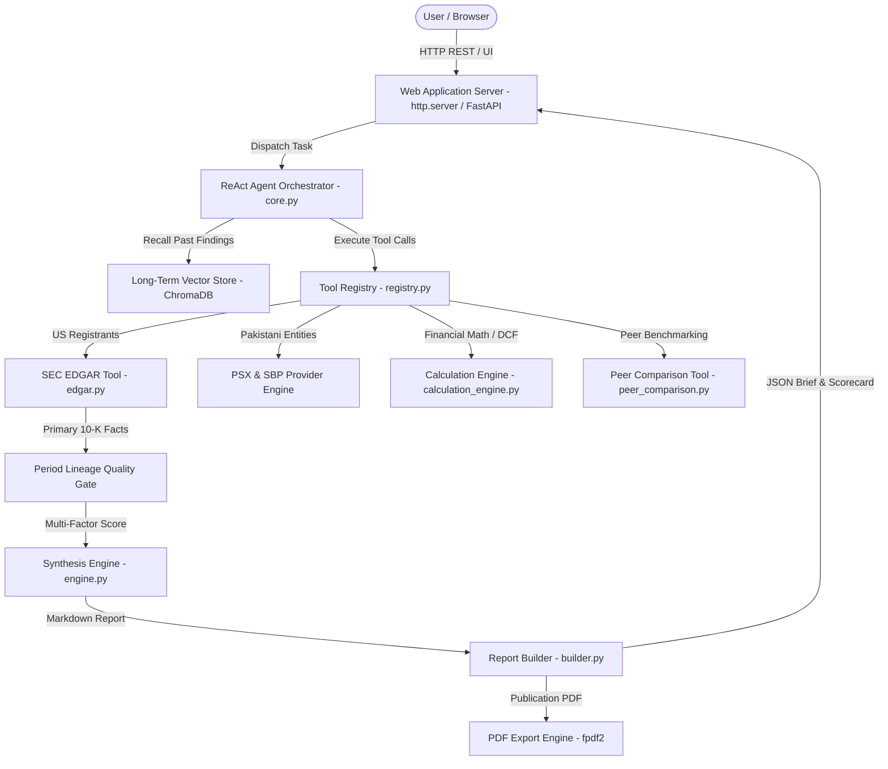

# ARA-1 Autonomous Financial Research Agent (QK Researcher)


> An institutional-grade autonomous AI agent framework designed for deterministic statutory financial statement extraction, 3-year primary Form 10-K filing lineage auditing, multi-market regulatory routing, DCF valuation modeling, and publication-grade PDF report synthesis.

---

## 🌟 Key Capabilities

- **Autonomous ReAct Agent Orchestrator**: Executes plan-and-execute reasoning loops with Step 0 vector memory recall, circuit breaker fault-tolerance, and multi-hop fallback manager.
- **Audited Statutory Filing Lineage**: Dynamically binds target fiscal years (FY2024, FY2023, FY2022) to their statutory primary Form 10-K filings with zero comparative restatement substitution.
- **Multi-Market Regulatory Support**: Dynamic routing across US SEC EDGAR (`SECProvider`), Pakistan Stock Exchange (`PSXProvider`), State Bank of Pakistan (`SBPProvider`), UK Companies House (`UKProvider`), and international markets (`ExtensibleFallbackProvider`).
- **Financial Calculation & DCF Valuation Engine**: Safe arithmetic, profitability margins (Gross, Operating, Net), ROE, ROA, CAGR, and 5-Year Discounted Cash Flow (DCF) intrinsic valuation modeling.
- **Long-Term Vector Memory (ChromaDB)**: Local 384-dim semantic embeddings (`all-MiniLM-L6-v2`) chunking and storing research findings for semantic recall.
- **Live Top Market Information Ticker**: Real-time auto-scrolling marquee bar tracking 10 market movers (`AAPL`, `MSFT`, `NVDA`, `AMZN`, `GOOGL`, `META`, `TSLA`, `JPM`, `BAC`, `WFC`) with 30s background TTL caching.
- **Publication-Grade Report Synthesis**: Renders markdown briefs with full citations, audit scorecards, and exports styled PDF documents (`fpdf2`).

---

## 📐 Architecture Overview



---

## 📊 Regulatory Source & Authority Support

| Entity Type / Ticker | Regulatory Authority | Provider Engine | Statutory Documents | Citation Format |
| :--- | :--- | :--- | :--- | :--- |
| **US SEC Filers** (`AAPL`, `JPM`, `AMZN`, `MSFT`, `NVDA`) | **US SEC EDGAR** | `SECProvider` | Form 10-K, Form 10-Q, XBRL Facts | `[Source: SEC EDGAR 10-K for JPM Accn: 0000019617-25-000270 Filed: 2025-02-14]` |
| **Pakistani Listed Entities** (`NBP`, `HBL`, `MEBL`, `BAFL`, `UBL`, `MCB`) | **Pakistan Stock Exchange** | `PSXProvider` | PSX Annual Reports & Disclosures | `[Source: Pakistan Stock Exchange Statutory Filing for NBP FY2024]` |
| **Central Bank of Pakistan** (`SBP`) | **State Bank of Pakistan** | `SBPProvider` | SBP Monetary Policy & FX Reports | `[Source: State Bank of Pakistan Official Disclosures]` |
| **UK Entities** | **UK Companies House** | `UKProvider` | Annual Accounts | `[Source: UK Companies House Disclosures]` |

---

## 🚀 Quick Start Guide

### Prerequisites
- Python 3.11+ or 3.14
- Git

### 1. Local Setup
```bash
# Clone the repository
git clone https://github.com/Quaid-khan/financial-research-agent.git
cd financial-research-agent

# Create and activate virtual environment
python -m venv venv
.\venv\Scripts\activate   # On Windows
# source venv/bin/activate # On Linux/macOS

# Install dependencies
pip install -r requirements.txt

# Create local environment configuration
cp .env.example .env
```

### 2. Start Application Server
```bash
python web/app.py 8050
```
Open your browser to:
👉 **`http://127.0.0.1:8050`**

### 3. Run Automated Tests
```bash
python -m pytest tests/
```

---

## 📂 Project Directory Structure

```text
financial-research-agent/
├── agent/                         # Autonomous ReAct Agent Architecture
│   ├── core.py                    # ReAct Control Loop & Vector Memory Recall
│   ├── memory/                    # Long-Term Memory (longterm.py - ChromaDB)
│   ├── providers/                 # Multi-Market Source Router (SEC, PSX, SBP, UK)
│   ├── resilience/                # Circuit Breaker & Fallback Chain Manager
│   ├── synthesis/                 # Synthesis Engine, Disambiguation & Lineage Gates
│   ├── tools/                     # Tool Registry (edgar, calculation_engine, peer_comparison, market_ticker)
│   └── reporting/                 # Markdown Report Templates & PDF Builder
├── docs/                          # Comprehensive Technical Specifications
│   ├── ARCHITECTURE.md            # System Architecture Specification
│   ├── RESEARCH_WORKFLOW.md       # 16-Step Execution Lifecycle
│   ├── API.md                     # REST API Documentation
│   ├── DOCKER.md                  # Docker Deployment Guide
│   ├── TESTING.md                 # Test Framework & Quality Assurance
│   ├── DATA_SOURCES.md            # Data Governance & Source Hierarchy
│   ├── AI_AGENTS.md               # Agent Design & Resilience Mechanics
│   ├── MEMORY.md                  # ChromaDB Embeddings & Vector Search
│   ├── REPORT_GENERATION.md       # Markdown & PDF Synthesis Specification
│   ├── UI.md                      # Frontend Dashboard & UI Specification
│   ├── TROUBLESHOOTING.md         # Operational Troubleshooting Guide
│   └── DEVELOPMENT.md             # Developer Onboarding Guide
├── examples/                      # Synthesized PDF Research Reports
├── tests/                         # 64-Test Pytest Suite
├── web/                           # Web Server (app.py) & Static Frontend
│   └── static/                    # index.html, styles.css, app.js, favicon.svg
├── .env.example                   # Sanitized Environment Configuration Template
├── CHANGELOG.md                   # Project Versioning & Release Log
├── CONTRIBUTING.md                # Open Source Contribution Guidelines
├── Dockerfile                     # Docker Deployment Container File
├── docker-compose.yml             # Docker Compose Configuration
├── README.md                      # Primary GitHub Presentation Document
├── requirements.txt               # Python Dependencies
└── SECURITY.md                    # Security Policy & Vulnerability Disclosure
```

---

## 📖 Technical Documentation Links

- 🏛️ [System Architecture](docs/ARCHITECTURE.md)
- 🔄 [16-Step Research Workflow](docs/RESEARCH_WORKFLOW.md)
- 🌐 [REST API Reference](docs/API.md)
- 🐳 [Docker Deployment Guide](docs/DOCKER.md)
- 🧪 [Testing & Quality Assurance](docs/TESTING.md)
- 📊 [Data Sources & Governance](docs/DATA_SOURCES.md)
- 🤖 [AI Agents & Resilience](docs/AI_AGENTS.md)
- 🧠 [Vector Memory (ChromaDB)](docs/MEMORY.md)
- 📝 [Report & PDF Generation](docs/REPORT_GENERATION.md)
- 🎨 [Frontend Dashboard UI](docs/UI.md)
- 🛠️ [Troubleshooting Guide](docs/TROUBLESHOOTING.md)
- 👩‍💻 [Developer Onboarding Guide](docs/DEVELOPMENT.md)

---

## 🛡️ Security & Fair Access Compliance

- **No Real Secrets Committed**: `.env` is ignored by `.gitignore`.
- **SEC Fair Access Rules**: Compliant `SEC_EDGAR_USER_AGENT` support header included in all outgoing HTTP requests.

---

## 📜 License

This project is licensed under the MIT License - see the `LICENSE` file for details.
